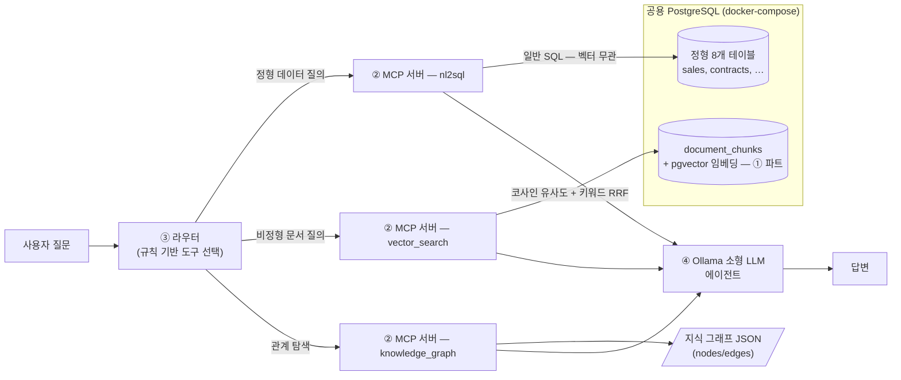

# MCP 기반 지능형 AI 검색 시스템

> 2026 오픈소스 개발자대회 지정과제 — 가상 기업 Company-X 운영 데이터에 대해
> 소형 LLM(Gemma 3 4B ~ Qwen 2.5 KO 7B)이 3종 MCP 도구로 답하는 검색 시스템.

## 전체 아키텍처



> DB 인스턴스는 하나지만 역할이 나뉜다: **nl2sql은 정형 테이블을 일반 SQL로 조회**하며
> 벡터단을 전혀 거치지 않고, pgvector(벡터 타입/인덱스 확장)는 `document_chunks`를 쓰는
> vector_search에만 관여한다.

## 파트 구성

| 디렉토리 | 파트 | 상태 |
|----------|------|------|
| [`vector-db/`](vector-db/) | ① 벡터 DB — 임베딩·저장·하이브리드 검색 + `vector_search` 도구 계약/참조 MCP 서버 | ✅ 완료 (자체 평가 top-3 적중률 100%) |
| [`mcp-server/`](mcp-server/) | ② MCP 서버 — vector_search·NL2SQL·knowledge_graph 3종 도구 | 🚧 작업 예정 |
| [`router/`](router/) | ③ 규칙 기반 도구 자동 선택 라우터 | 🚧 작업 예정 |
| [`agent/`](agent/) | ④ Ollama 소형 LLM 에이전트 연동 | 🚧 작업 예정 |

공용 리소스(레포 루트):

- `docker-compose.yml` — PostgreSQL 16 + pgvector. 모든 파트가 같은 DB를 사용
- `os_dataset/` — 대회 제공 데이터셋. **라이선스상 git에 포함하지 않음** —
  `companyx-dataset-v1.0.zip`을 풀어 이 이름으로 루트에 배치 (구조는 `vector-db/README.md` 참고)
- `.mcp.json` — Claude Code용 MCP 서버 등록

## 빠른 시작

```bash
# 0. 데이터셋을 루트에 os_dataset/ 으로 배치 (위 참고)
docker compose up -d --wait                    # 1. 공용 DB 기동 + 데이터셋 자동 적재
pip install -r vector-db/requirements.txt      # 2. 파이썬 의존성
python vector-db/pipeline/load.py              # 3. 문서 임베딩 적재 (Ollama bge-m3 필요)
python vector-db/pipeline/search.py "SSL 인증서 관련 장애가 있었어?"   # 4. 검색 확인
```

상세 실행·평가 방법은 각 파트의 README를 참고.

## 팀 인터페이스

- **`vector_search` 도구 계약**: [`vector-db/docs/vector-search-contract.md`](vector-db/docs/vector-search-contract.md)
  — MCP 서버 파트는 이 명세대로 도구를 노출하면 됨 (참조 구현: `vector-db/pipeline/mcp_server.py`)
- **라우터 보조 자료**: 임베딩 유사도 분류 프로토타입 `vector-db/pipeline/router_prototype.py`
  (30문항 76% — 규칙 기반의 폴백으로 제안)
- **평가셋**: `os_dataset/questions.json` (도구별 10문항, 총 30문항)
