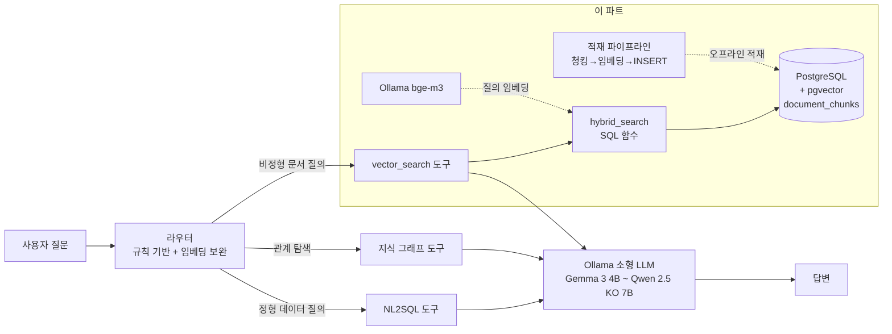
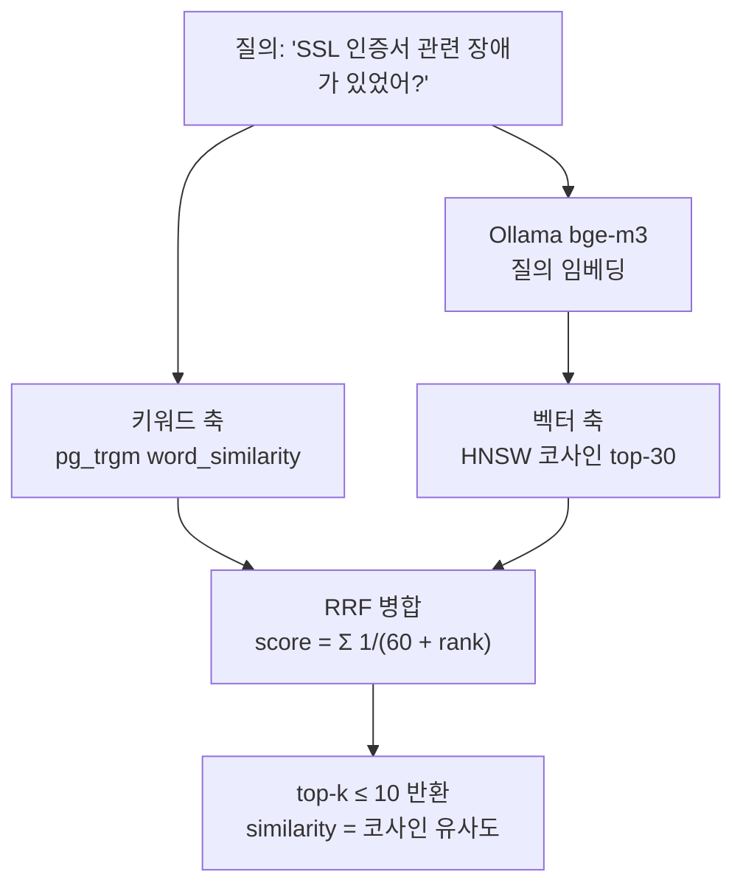

# 벡터 데이터베이스 파트 — 설계 근거

> 2026 오픈소스 개발자대회 지정과제 · MCP 기반 지능형 AI 검색 시스템
> 담당 범위: PostgreSQL + pgvector 기반 문서 임베딩·저장·의미 검색

## 1. MCP 파이프라인에서 이 파트의 위치



이 파트는 (1) 오프라인 적재 파이프라인과 (2) MCP 서버가 감싸는 검색 함수, 그리고
(3) 팀 인터페이스인 도구 계약(`docs/vector-search-contract.md`)을 제공한다.

## 2. 청킹 전략과 파라미터

**전략: 헤딩 분할 → 목표 토큰까지 병합 → 초과분 재분할(overlap)**

1. `##`/`###` 헤딩 단위 1차 분할 — Markdown 문서의 의미 경계와 일치
2. 작은 섹션은 400토큰(목표)까지 그리디 병합 — 이 데이터셋 문서는 대부분 200~250토큰의
   짧은 보고서라, 헤딩 단위 그대로 두면 1~3줄짜리 파편 청크가 대량 생기고
   "기본 정보"·"담당자" 같은 섹션이 문서 맥락을 잃는다. 병합 결과 대부분의 문서가
   **문서 전체 = 1청크**가 되며, 이것이 이 데이터셋에서는 검색 단위로도 최적이다
   (장애보고서는 "내용+원인+조치"가 함께 있어야 답변 재료가 됨)
3. 500토큰 초과 섹션은 문단 단위 재분할 + 약 50토큰 overlap — 경계에 걸친 문맥 소실 방지
4. 각 청크 앞에 `# {문서 제목}` 헤더를 붙임 — 임베딩에 문서 수준 맥락(고객사·제품·유형)이
   반영되고, 소형 LLM이 청크만 보고도 출처를 알 수 있다

**파라미터: 목표 400 / 최대 500 / overlap 50 (토큰)**
- 상한 500토큰: top-5 반환 시 검색 결과 총량 ≈ 2천 토큰. Gemma 3 4B급(8K 컨텍스트)에서
  시스템 프롬프트 + 대화를 더해도 여유가 남는 수준으로 설계
- 토큰 수는 근사 추정(`estimate_tokens`): CJK 음절 1토큰 + 영단어 1.3토큰.
  정확한 토크나이저 로딩 의존성을 피하면서 bge-m3(XLM-R 계열)의 한국어 토큰화 특성
  (음절≈1토큰)에 근접한 추정치를 사용. 청킹 경계 결정에는 ±10% 오차가 무해함

메타데이터(JSONB): `doc_id`, `doc_type`(한글 enum), `doc_type_raw`, `doc_title`,
`chunk_index`, `source_path` — MCP 계약의 출력 필드와 필터(`doc_type`)를 그대로 지원.

## 3. 임베딩 모델: `bge-m3` (1024차원)

| 후보 (Ollama) | 차원 | 한국어 | 비고 |
|---------------|------|--------|------|
| **bge-m3** ✅ | 1024 | ◎ (다국어 학습, MIRACL ko 상위권) | 566M 파라미터, 8K 입력. 채택 |
| nomic-embed-text | 768 | △ (영어 중심) | 데이터셋 README 예시 모델이나 한국어 성능 열세 |
| mxbai-embed-large | 1024 | △ (영어 중심) | 한국어 미검증 |
| snowflake-arctic-embed2 | 1024 | ○ (다국어) | bge-m3 대비 한국어 벤치마크 근거 부족 |

- 데이터가 전부 한국어이므로 **한국어 검색 품질이 1순위 기준**. bge-m3는 다국어 임베딩
  중 한국어 retrieval 벤치마크(MIRACL ko 등)에서 검증된 사실상 표준
- 속도: 로컬 CPU에서도 수백 청크 배치 임베딩에 수 분 이내 — 오프라인 적재이므로 충분

**차원 불일치 처리**: 데이터셋 원본 스키마는 `vector(768)`(nomic 기준)이나, 과제 규칙상
`document_chunks` 적재 구현이 참가자 몫이므로 스키마 조정이 허용된다고 판단,
초기화 스크립트(`initdb/03-vector-setup.sql`)에서 `vector(1024)`로 변경했다.
**원본 데이터셋 파일은 수정하지 않고** 후속 ALTER로 처리해 데이터셋 무결성을 유지.
만약 스키마 변경이 금지된다면 `EMBED_MODEL=nomic-embed-text EMBED_DIM=768` 환경변수만으로
전환 가능하도록 파이프라인을 파라미터화해 두었다.

## 4. 인덱스: HNSW (vs IVFFlat)

```sql
CREATE INDEX ... USING hnsw (embedding vector_cosine_ops);
```

- **IVFFlat은 데이터가 적재된 상태에서 생성해야** 리스트 센트로이드가 학습되고,
  재적재(TRUNCATE 후 재삽입) 때마다 인덱스 재생성이 필요하다. 우리 파이프라인은
  멱등 재적재(항상 TRUNCATE→INSERT)를 쓰므로 **삽입 시 증분 구축되는 HNSW**가
  운영 흐름과 맞다 (빈 테이블에 미리 만들어 둘 수 있음)
- 재현율: 동일 속도 조건에서 HNSW가 IVFFlat보다 recall이 높다는 것이 pgvector 공식
  문서의 권고. 검색 품질이 평가 기준인 본 과제에 적합
- 트레이드오프: HNSW는 빌드 시간·메모리가 크지만, 본 데이터는 수백 청크 규모라 무의미
- 솔직한 한계: 이 규모에서는 seq scan도 밀리초 단위라 인덱스가 성능상 필수는 아니다.
  다만 데이터 증가 시의 확장성과 설계 완결성을 위해 처음부터 인덱스 경로를 깔아 둔다

## 5. 하이브리드 검색 구조



- **왜 키워드 축이 필요한가**: "SSL", "Kubernetes", 제품명·에러코드 같은 질의는
  임베딩 공간에서 주변 의미에 뭉개질 수 있다. 정확 문자열 매칭 축이 이를 보완
- **왜 tsvector가 아니라 pg_trgm인가**: PostgreSQL 내장 text search 설정에는 한국어
  형태소 분석기가 없다(`simple` 설정은 공백 분리만 하므로 "인증서가"≠"인증서").
  trigram은 언어 무관 부분 문자열 유사도라 조사가 붙은 한국어와 영문 키워드 모두에서
  동작한다. 외부 형태소 분석기(mecab 등) 의존성을 추가하지 않는 선택이기도 함
- **RRF(k=60)**: 두 축의 점수 스케일(코사인 0~1 vs trigram 유사도)이 달라 점수 가중합은
  튜닝 부담이 크다. RRF는 순위만 사용하므로 스케일 문제가 없고, k=60은 원 논문의
  표준값. 축별 후보 30개(top_k의 3배 이상)로 병합 후 상위 top-k만 반환

## 6. 소형 LLM 제약을 고려한 응답 설계

최종 소비자가 Gemma 3 4B ~ Qwen 2.5 KO 7B급임을 전제로:

1. **총량 상한**: 청크 ≤ 500토큰 × top_k ≤ 10 (기본 5) → 최악 5천, 기본 2천 토큰 이내
2. **평평한 JSON 배열**: 중첩 구조 없이 6개 필드 고정 — 소형 모델의 구조 해석 부담 최소화
3. **청크에 제목 헤더 내장**: LLM이 별도 매핑 없이 출처(문서·유형)를 인용 가능
4. **`similarity`는 0~1 코사인 고정**: 관련도 임계 판단에 쓸 수 있는 해석 가능한 단일 지표
5. **`doc_type` 필터를 도구 입력으로 노출**: 라우터/LLM이 "장애보고서에서 찾아줘" 같은
   의도를 검색 범위 축소로 직접 반영 → 불필요한 청크가 컨텍스트에 들어가는 것 자체를 차단

## 7. 팀 인터페이스 요약

| 산출물 | 소비자 | 위치 |
|--------|--------|------|
| `hybrid_search`/`vector_search` SQL 함수 | MCP 서버 담당 | `initdb/03-vector-setup.sql` |
| `search.py` Python 래퍼 (임베딩 포함) | MCP 서버 담당 | `pipeline/search.py` |
| 도구 계약 문서 | MCP 서버·라우터 담당 | `docs/vector-search-contract.md` |
| 라우터 프로토타입 (임베딩 유사도 분류) | 라우터 담당 | `pipeline/router_prototype.py` |

라우터 프로토타입 측정 결과(`questions.json` 30문항, 도구별 수작업 예시 5개 기준):
**전체 76% (23/30)** — nl2sql 8/10, vector_search 6/10, knowledge_graph 9/10.
단독 사용보다는 규칙 기반 라우터가 판단하지 못한 질문의 폴백(fallback)으로 쓰는 것을 제안한다.
| 평가 결과 | 전체 | `docs/evaluation.md` |
